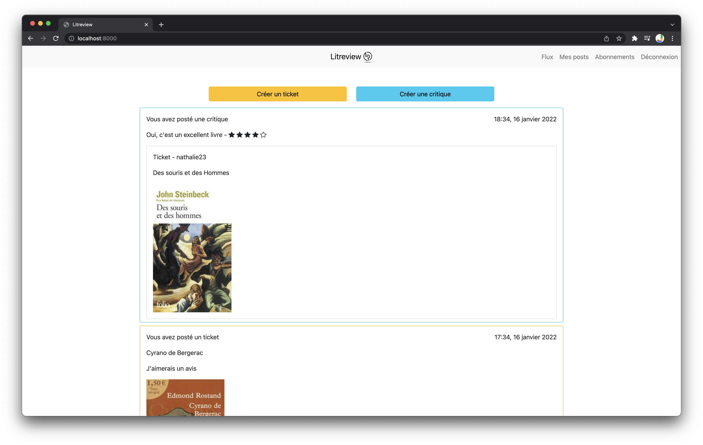
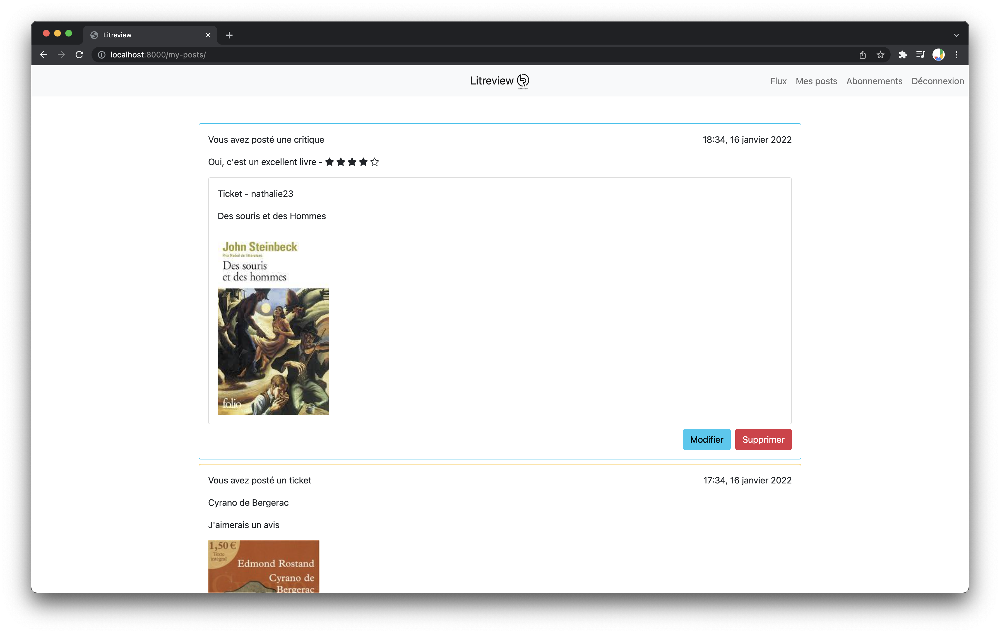
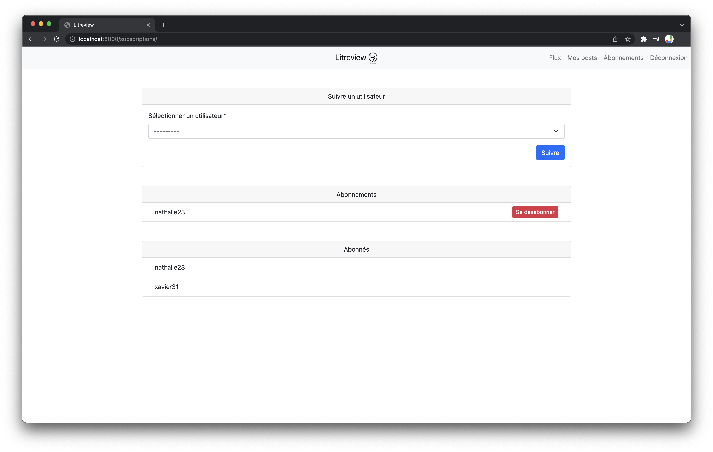

# P09_LITReview
## Table of contents
- [Table of content](#table-of-content)
- [Foreword](#foreword)
- [Installation](#installation)
- [How to use](#how-to-use)
- [Possible improvements](#possible-improvements)

## Foreword

The aim of this projet is to build a web application wich allows user to ask or publish reviews of books or articles (or whatever you want)

This application has 2 mains use cases :
- users who ask for reviews on a particular book
- users who look for interesting books, based on the other users' reviews

This is a MVP (Minimum Viable Product). So the front-end is simple. I tried to customize as best as I could the wireframes the project given to me.

I build this application using Django
## Installation

### Clone the code source (using ssh)

    mkdir foo
    git clone git@github.com:jjbochard/P09_LITReview.git foo
    cd foo

### Create your virtual environnement

First, install [Python 3.6+](https://www.python.org/downloads/).

Then, create your virtual environnement :

    python3 -m venv <your_venv_name>

Activate it :

- with bash command prompt

        source <your_venv_name>/bin/activate

- or with Windows PowerShell

        .\venv\Scripts\activate

Finally, install required modules

    pip3 install -r requirements.txt

To deactivate your venv :

    deactivate

### Django management commands and run Django

First, apply all migrations to the database :

    django litreview/manage.py migrate

Then, create a superuser in order to be able to connect you to the application and use Django admin:

    django litreview/manage.py createsuperuser

Finally, start the web application

    django litreview/manage.py runserver

### Optionnal : configure your git repository with pre-commit (if you want to fork this project)

You can install pre-commit with python

    pip install pre-commit

You can install the configured pre commit hook with

    pre-commit install
## How to use

Open your favorite browser and go to [localhost:8000](http://localhost:8000/)

On the main page, a user can see all posts related to him :
* his tickets and reviews
* reviews and tickets of the users he follows
* reviews of his tickets made by users even if he doesn't follow them

A user can also create a ticket and create in one form a ticket and a review

On the page of his posts, a user can see only his posts and can modify or delete them

On the subscription page, a user can see all the users he follows and all the users who follow him.
He can also subscribe/unsubscribe to a user

## Possible improvements

* Bootstrap vizalisation
